## Reboot

I've been meaning to start a blog for a while, mainly as way to write about my
travels and weekend wanderings. I have tons of photos saved that are just
collecting dust. Occasionally I would post something on
[Instagram](https://www.instagram.com/jackhxs/) but I wanted something that was
more flexible, where I can do some writing as well as showcase photos. I
finally decided to stop being lazy and just do it. I briefly considered adding
to my old [personal site](https://lanjian.github.io), but it's so old that I'd
probably end up redoing it anyways. After looking through [a list of static
site generators](https://jamstack.org/generators), I decided to make a new site
using [Zola](https://www.getzola.org/) since it's written in Rust.

There is still much to do for the new site. I picked a theme geared towards
photoblogging that had better support for images and galleries, but everything
else looks kind of meh. I will probably make a lot of changes as I go. I also
want to start making cinemagraphs and embed them into posts, which I haven't
spent time on figuring out how to do yet. Given my propensity for perfectionism
to the point of inaction, I thought it was best that I just start making posts
even if I don't have everything figured out yet.

**Update 2023-07-05**: I ended up switching to [Hugo](https://gohugo.io/) since
I wasn't completely satisfied with the Zola theme. There is a limited selection
of Zola themes to choose from because It's newer. I'm a lot happier with the
Blowfish theme for Hugo, which is a lot more mature and had more features than
the themes I've tried for Zola. Switching to Hugo itself was pretty painless,
though I did spend quite a long time extending the theme to be able to display
[full-width images](#clear-lake) with my limited frontend skills. 

## Mendocino

After living in the Bay Area for many years, I feel like I've already been to
most of the interesting places nearby that are feasible to visit on a
motorcycle for a day trip. So recently, I started looking into farther places
that I can ride to for weekend trips. 

For memorial day weekend, I decided to ride up north to Mendocino and Clear
Lake. This is my first time riding north past Tomales Bay. Highway 1 northbound
is just as nice as southbound, but with less people. Though the weather was
very grey that day. First night was spent in Fort Bragg.


  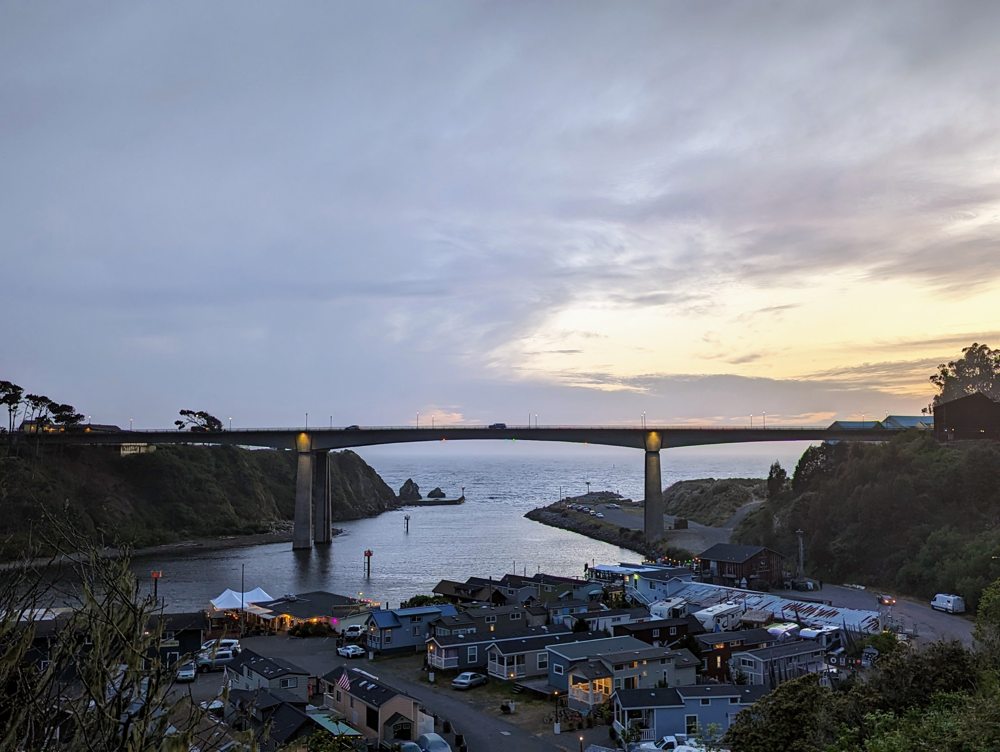
  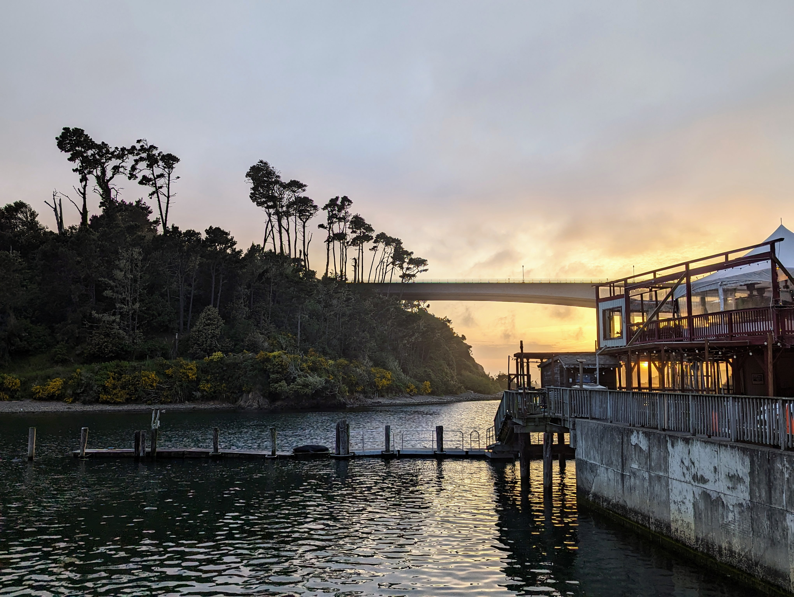
  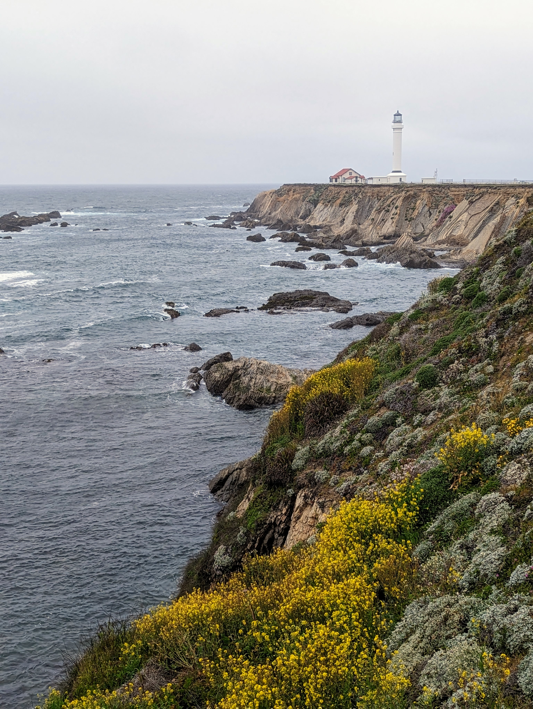
  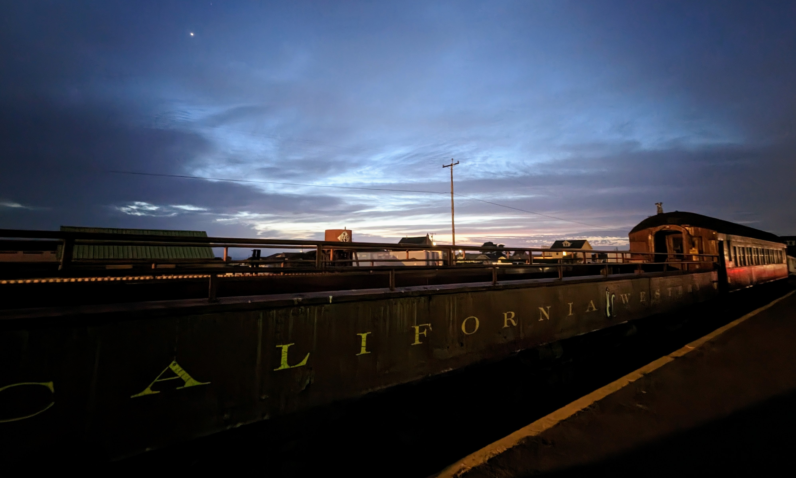


Glass beach was kind of overrated. It definitely did not look as colorful as
the photos online. The pieces of glass are small and it looks like a lot of it
has been picked off by tourists already. Mendocino was a nice little coastal
town. It felt a little like Carmel, complete with upscale brunch spots and
boutique stores.


  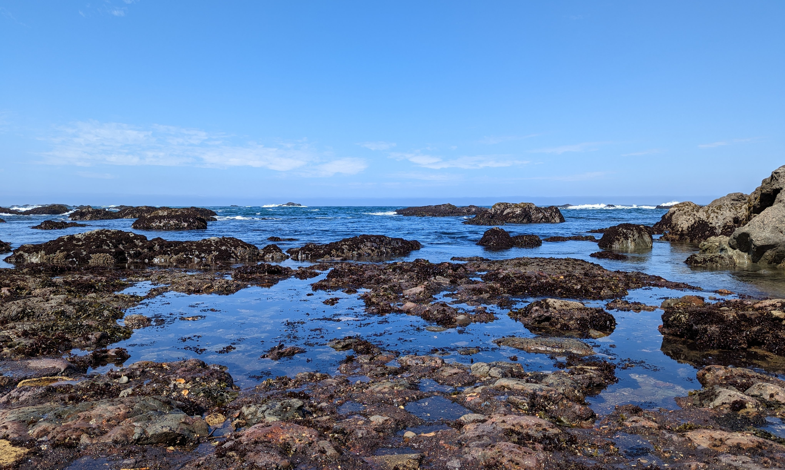
  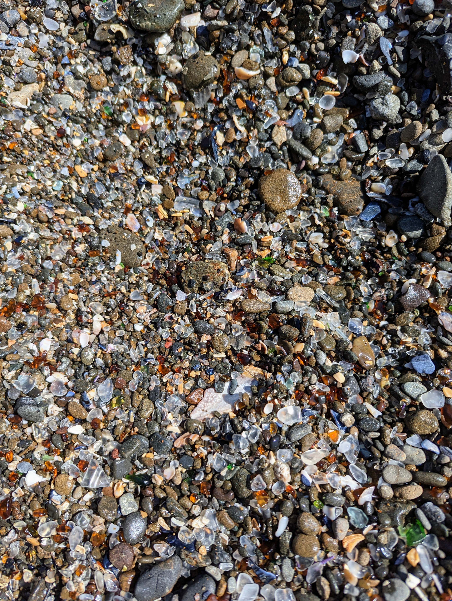
  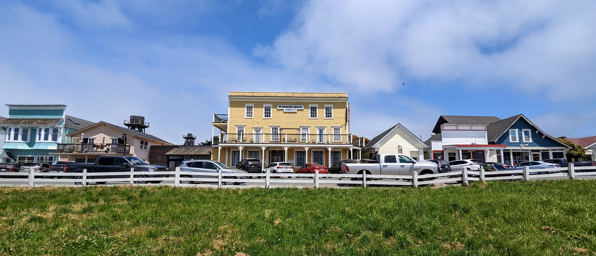
  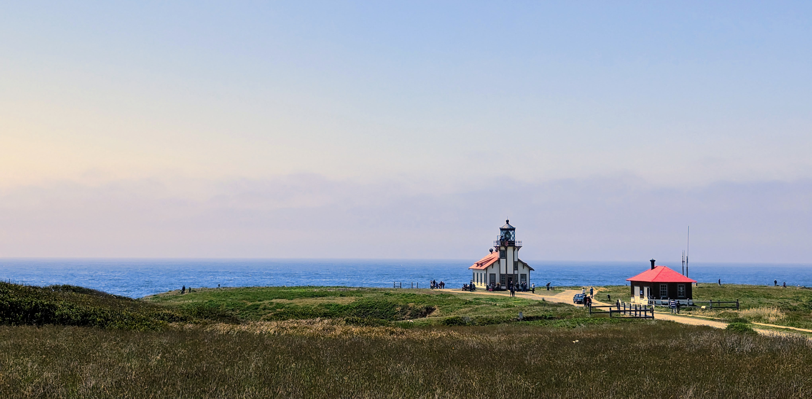


## Clear Lake



The ride from the coast inland to Clear Lake started out great, but it didn't
take long before it started raining. I didn't have rain gear so there was no
choice but to just power through it and take a hot shower afterwards. The hotel
at [Featherbed Railroad](https://www.featherbedrailroad.com/) was the highlight
of the trip. It was a real train caboose turned into a room. There were 8
cabooses in total, and each one is decorated in a different theme. The one I
stayed at had a tropical island theme. Apparently they make something different
each day of the week for breakfast, and this time it was homemade biscuits and
gravy. It was a cool experience. I'm actually looking forward to going back sometime
next year after they set up the dock with jet skis. 


  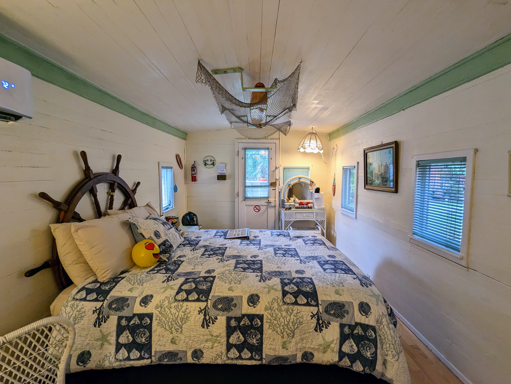
  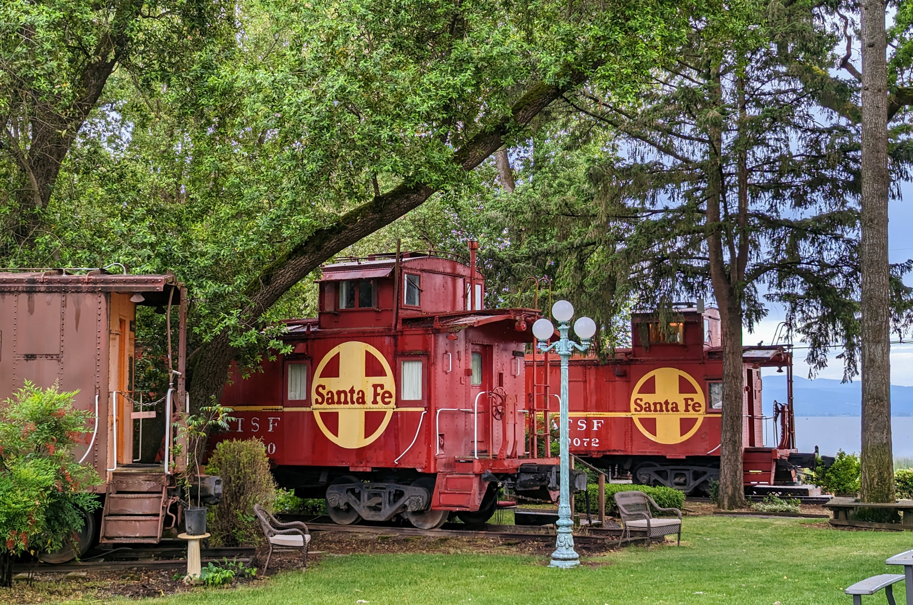
  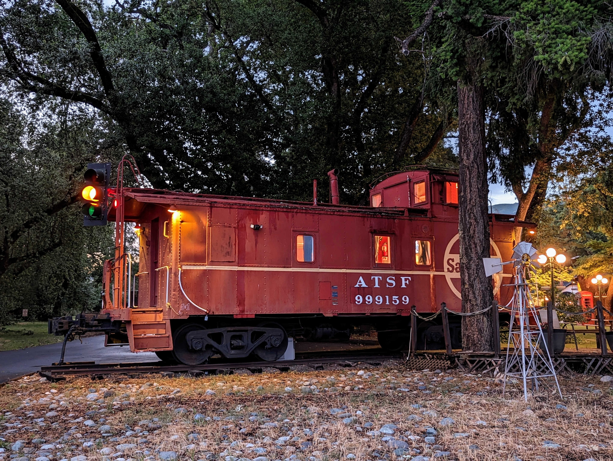
  

